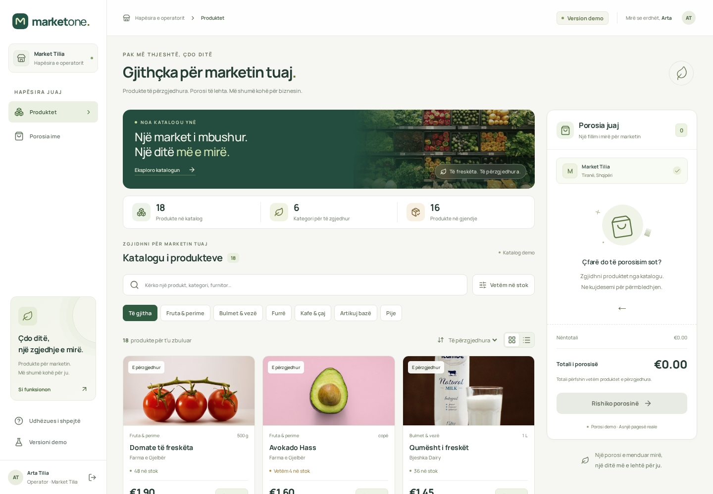

# MarketOne · Operator Dashboard

Prototip funksional për Detyrën 1 të INFINITRON. Një hapësirë e thjeshtë për të kërkuar produkte, përgatitur një porosi dhe parë totalin. Ndërfaqja dhe dokumentimi janë në shqip.

**Ky është një demonstrim:** llogaria, produktet, furnitorët dhe konfirmimi i porosive janë të simuluara. Nuk kryhen pagesa dhe nuk dërgohen porosi te furnitorët.

**Demo live:** [Hapni MarketOne](https://marketone.178-104-201-39.sslip.io)



## Detyra 2 · Propozimi teknik

Propozimi prej dy faqesh mbulon arkitekturën, rolet, entitetet e databazës, API-të, sigurinë dhe ndarjen MVP/faza e dytë. Përfshin diagramin, supozimet e biznesit, burimet dhe deklarimin e AI.

- [PDF për rishikim dhe dorëzim](docs/task2/MarketOne-Propozim-Teknik.pdf)
- [Teksti i redaktueshëm](docs/task2/MarketOne-Propozim-Teknik.md)

## Nisja lokale

Kërkohet Node.js 22.12+ (rekomandohet Node 24) dhe npm.

```bash
npm ci
npm run dev
```

Hapni http://localhost:5173. Të gjitha imazhet, fontet dhe të dhënat shërbehen lokalisht; aplikacioni nuk varet nga një API publike ose CDN gjatë përdorimit.

| Hyrja demo  | Vlera                   |
| ----------- | ----------------------- |
| Email       | `operator@marketone.al` |
| Fjalëkalimi | `MarketOne123!`         |

Butoni **Plotëso të dhënat demo** plotëson formularin; më pas zgjidhni **Hyr në MarketOne**. Këto janë kredenciale publike demonstrimi, jo sekrete.

## Çfarë përfshihet

- Login i simuluar me validim, shfaqje të fjalëkalimit, gjendje pritjeje dhe dalje.
- 18 produkte në 6 kategori, secili me emër, çmim, njësi dhe stok.
- Kërkim sipas produktit, kategorisë ose furnitorit. Kërkimi mbështet shqipen edhe pa ë/ç.
- Filtër sipas kategorisë dhe stokut; renditje sipas çmimit ose emrit; pamje me karta ose listë.
- Shtim, ulje/rritje sasie, heqje dhe zbrazje e porosisë me konfirmim.
- Kufij stoku; produktet pa stok kanë buton të çaktivizuar.
- Total në EUR i llogaritur me numra të plotë në cent.
- Rishikim me miniatura, konfirmim demonstrues në formë mandati dhe shkarkim i përmbledhjes `.txt`.
- Pamje responsive; shportë anësore në desktop, shirit dhe dialog në mobile.
- Kërkim dhe kategori që qëndrojnë sipër gjatë shfletimit në mobile; kontrolle sasie më të mëdha.
- Fotografi të njëtrajtshme të produkteve dhe imazhe rezervë në rast dështimi.
- Sinjalizim i lehtë vizual kur ndryshon sasia ose totali, me respektim të reduced motion.
- Loading skeleton, error me riprovim, katalog bosh, kërkim pa rezultate dhe shportë bosh.
- Ruajtje e shportës dhe hyrjes në `sessionStorage` për skedën aktuale; dalja i pastron.
- Dialogë me fokus të kufizuar brenda, mbyllje me Escape dhe rikthim të fokusit; mbështetje për reduced motion.

## Si provohen gjendjet

Hapni **Version demo** në krye të dashboard-it ose në menunë anësore:

| Skenari            | Sjellja                                                      |
| ------------------ | ------------------------------------------------------------ |
| Katalogu i plotë   | Ngarkim normal i JSON-it lokal                               |
| Ngarkim i ngadaltë | Skeleton për 8 sekonda, pastaj produktet                     |
| Gabim në ngarkim   | Mesazh gabimi; **Provo përsëri** rikthen katalogun normal    |
| Katalog bosh       | Mesazh pa produkte; **Rifresko katalogun** rikthen katalogun |

Kërkoni `nuk-ekziston` për gjendjen pa rezultate. Avokado dhe kafeja kanë stok të ulët; mollët dhe uji janë pa stok. **Kthehu te katalogu** del nga skenari demo. Shporta nuk fshihet nga ndryshimi i skenarit; konfirmimi bllokohet ndërsa katalogu është bosh, po ngarkohet ose ka gabim.

## Struktura dhe zgjedhjet teknike

```text
src/
  components/        Brand, navigimi, dialogët dhe imazhet
  features/
    auth/            Formulari i hyrjes demo
    products/        Marrja/validimi i të dhënave, filtrat, katalogu
    cart/            Reducer i porosisë, përmbledhja dhe konfirmimi
  lib/               Formatimi i monedhës dhe ruajtja në shfletues
  styles/            Stilet për login, katalog dhe shportë
  App.tsx            Organizimi i faqeve dhe state-it të përbashkët
  types.ts           Modelet TypeScript
public/
  data/products.json Katalogu lokal
  images/            Fotografitë dhe fallback SVG
tests/               Teste Playwright për rrjedhat reale të përdoruesit
deploy/              Hostimi i izoluar dhe heqja e tij
```

**React + TypeScript + Vite:** komponentë të vegjël sipas funksionit dhe kontrolle statike të të dhënave. Aplikacioni ndërtohet si skedarë statikë; nuk kërkon backend, databazë ose proces Node në hostim.

**State:** `useReducer` mban rregullat e sasive në një vend. Totali nxirret nga artikujt dhe nuk ruhet si state i dytë. Filtrat qëndrojnë në katalog; një hook merret me ngarkimin dhe anulon kërkesën me `AbortController` kur ndryshon skenari ose çmontohet faqja. Për këtë përmasë nuk nevojitet Redux ose një bibliotekë kërkesash.

**Imazhet:** `ProductImage` shfaq një qelizë nga një atlas lokal përmes SVG `viewBox` dhe `clipPath`. Atlasi ripërdoret për 18 produktet pa kërkesa të veçanta; gabimi i ngarkimit aktivizon një fotografi rezervë, pastaj një SVG të përgjithshme. Prompt-i dhe përdorimi i AI janë dokumentuar.

**Të dhënat:** përgjigjja JSON validohet në kohë ekzekutimi, përfshirë ID unike, çmime pozitive dhe stok të vlefshëm. Shporta e ruajtur pastrohet nga vlerat e pavlefshme dhe pajtohet me stokun pas ngarkimit.

**Dizajni:** CSS i organizuar sipas pjesëve, variabla për ngjyrat, fonti Manrope i hostuar lokalisht dhe ikona Lucide. Nuk ka framework CSS: stilet janë të përshtatura për këtë ndërfaqe. Fotografitë dhe burimet listohen te [ASSETS.md](ASSETS.md).

Burime teknike: [Vite](https://vite.dev/guide/), [React useReducer](https://react.dev/reference/react/useReducer), [Playwright](https://playwright.dev/docs/intro).

## Kontrollet

```bash
npm run lint
npm run format:check
npm test
npm run build
```

Testet e logjikës kontrollojnë sasitë, kufijtë e stokut, centët, shportën e dëmtuar dhe validimin e katalogut.

Për testet në shfletues, ndërtoni aplikacionin dhe nisni preview në një terminal:

```bash
npm run build
npm run preview
```

Në një terminal tjetër (Linux/macOS):

```bash
npx playwright install --with-deps chromium
BASE_URL=http://localhost:4173 npm run test:e2e
```

Në PowerShell përdorni `$env:BASE_URL="http://localhost:4173"` dhe pastaj `npm run test:e2e`. Në serverin e demonstrimit testet përdorin `http://127.0.0.1:8094`.

Testet përfshijnë hyrjen, kërkimin, stokun, rifreskimin, konfirmimin, shkarkimin, gabime të rrjetit, skenarët demo, tastierën, gjerësi ekrani 320–1440 px dhe kontrolle automatike aksesueshmërie me axe. Kontrolli automatik nuk zëvendëson vlerësimin manual.

Rezultatet e verifikimit dhe kufizimet e testimit janë te [docs/VERIFICATION.md](docs/VERIFICATION.md).

## Kufizime të qëllimshme

- Login-i kryhet në klient dhe **nuk ofron autentikim real**. Mos përdorni të dhëna private.
- Stoku dhe çmimet janë statike. Konfirmimi nuk ndryshon JSON-in dhe nuk krijon porosi në server.
- Shporta është për skedën aktuale. Nuk ka sinkronizim mes pajisjeve ose historik porosish.
- Transporti dhe llogaritja fiskale nuk janë pjesë e kërkesës; totali përfshin vetëm produktet.
- Kodi i aplikacionit mbulon **Detyrën 1**. Propozimi teknik i **Detyrës 2** është te `docs/task2/`; nuk është implementuar backend-i i propozuar.

## Hostimi i përkohshëm

Konfigurimi i këtij serveri dhe hapat për çaktivizim janë te [deploy/README.md](deploy/README.md). Publikohet vetëm `dist/`, jo kodi burim ose mjetet e zhvillimit. Nuk është vendosur fshirje automatike.

## Përdorimi i AI

Shihni [AI-USAGE.md](AI-USAGE.md). Kandidati duhet ta rishikojë dhe ta përditësojë deklarimin me kontributet reale personale përpara dorëzimit.
