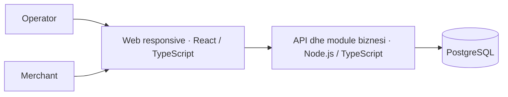

# MarketOne — Propozim teknik

INFINITRON · Software Developer · Detyra 2

MarketOne lidh bizneset në Shqipëri me furnitorët: zbulim produktesh, porositje dhe ndjekje e përmbushjes në një platformë.

**Supozime për MVP:** transporti nga furnitori; pagesa jashtë platformës; stok i deklaruar nga Merchant-i; një monedhë fillestare, ALL. Monedha, TVSH-ja dhe kushtet e transportit konfirmohen me biznesin.

## 1. Organizimi i aplikacionit

**React + TypeScript** për web responsive; **Node.js + TypeScript** për një backend modular; **PostgreSQL** për të dhënat. Modulet: identiteti/bizneset, katalogu, stoku, porositë, mbulimi territorial dhe njoftimet.

Një projekt backend me module të ndara lehtëson mirëmbajtjen dhe transaksionet. Imazhet ruhen veçmas; njoftimet dërgohen në sfond, me riprovim. Adresa e dorëzimit përcakton furnitorët e disponueshëm.

## 2. Rolet dhe të drejtat

**User** përfaqëson personin; **Business** marketin ose furnitorin; **Membership** lidh personin me biznesin dhe të drejtat e tij. Një biznes mund të ketë disa punonjës.

| Roli     | Të drejtat                                                                                                              |
| -------- | ----------------------------------------------------------------------------------------------------------------------- |
| Operator | Shikon ofertat e disponueshme; krijon dhe ndjek porositë e biznesit të vet; anulon para pranimit dhe konfirmon marrjen. |
| Merchant | Menaxhon produktet, çmimet, stokun dhe zonat e veta; pranon/refuzon porositë që i drejtohen dhe shënon nisjen.          |

Serveri verifikon anëtarësimin, lejen dhe lidhjen me objektin në çdo kërkesë. Porosia lexohet nga blerësi dhe furnitori përkatës; veprimet varen nga roli dhe statusi. Administrimi i brendshëm ka leje të kufizuara dhe veprime të regjistruara.

## 3. Entitetet kryesore të databazës

| Entitetet                    | Përgjegjësia                                      |
| ---------------------------- | ------------------------------------------------- |
| User · Business · Membership | Identiteti, lloji i biznesit dhe të drejtat       |
| Address · ServiceArea        | Adresa dhe zona që furnizon Merchant-i            |
| Category · Product           | Furnitori, njësia e shitjes, çmimi dhe aktivizimi |
| Inventory · StockReservation | Sasia e deklaruar dhe rezervimet aktive           |
| Checkout · Order · OrderItem | Grupimi i shportës; një porosi për furnitor       |
| OrderStatusHistory           | Statusi, autori, koha dhe arsyeja e ndryshimit    |

Çdo porosi ruan blerësin dhe furnitorin; artikujt ruajnë emrin, njësinë dhe çmimin e pranuar, ndërsa adresa ruhet si kopje historike. Shumat: NUMERIC + monedha, me aritmetikë dhjetore të saktë. Produktet çaktivizohen pa cenuar historikun.

## 4. API-të dhe rrjedha e porosisë

Një shportë me disa furnitorë krijon një Checkout dhe nga një Order për secilin. API-ja kthen vetëm të dhënat që biznesi i autentikuar lejohet të përdorë.

| Endpoint                        | Përgjegjësia                                          |
| ------------------------------- | ----------------------------------------------------- |
| `GET /products`                 | Katalog: kërkim, kategori, furnitor, zonë dhe faqe    |
| `GET /products/:id`             | Detajet e një produkti të disponueshëm                |
| `POST /products`                | Merchant: krijon produktin e vet                      |
| `PATCH /products/:id`           | Merchant: ndryshon ose çaktivizon produktin e vet     |
| `PATCH /products/:id/inventory` | Merchant: ndryshon stokun, duke respektuar rezervimet |
| `POST /checkouts`               | Operator: validon shportën dhe krijon porositë        |
| `GET /orders · GET /orders/:id` | Lista dhe detajet për palët e porosisë                |
| `PATCH /orders/:id/status`      | Vetëm kalime të lejuara sipas rolit dhe gjendjes      |

**Dërguar për miratim → Pranuar → Nisur → Marrë nga blerësi**

Nga statusi fillestar: refuzim, anulim ose skadim. Serveri kontrollon kalimet dhe regjistron historikun.

**Saktësi.** Serveri rillogarit totalet dhe kontrollon zonën, njësitë, çmimet e stokun. Ndryshimi i çmimit kërkon rishikim nga blerësi.

**Stok.** Të gjitha porositë dhe rezervimet krijohen në një transaksion, me bllokim rreshtash. Një grup i pavlefshëm bllokon krijimin; më pas porositë trajtohen veçmas.

**Rikuperim.** Idempotency-Key për biznes/kërkesë shmang dublimin gjatë riprovimit. Refuzimi, anulimi ose skadimi lirojnë rezervimin vetëm një herë; nisja konsumon stokun dhe mbyll rezervimin.

## 5. Siguria dhe besueshmëria

HTTPS; fjalëkalime me **Argon2id**; sesione në server me cookies **HttpOnly / Secure / SameSite**, skadim dhe mbrojtje CSRF. Validim në server, pyetje të parametrizuara, kufizim tentativash hyrjeje, MFA për administrimin, regjistër veprimesh dhe backup-e me prova rikthimi.

**Teste:** izolimi i bizneseve, porosi konkurruese, riprovim, anulim i dyfishtë dhe çmime historike. Rezervimi mbron stokun në platformë; saktësia fizike varet nga furnitori.

## 6. MVP dhe faza e dytë

**Versioni i parë:** Login real, verifikim biznesesh dhe role; katalog, stok e zona furnizimi; porosi, historik dhe njoftime; administrim dhe web responsive. Pilot me biznese të përzgjedhura.

**Faza e dytë:** Pagesa online; integrime magazinash/faturimi; çmime të negociuara; dorëzime të pjesshme, kthime e transport i avancuar; aplikacione native. Zgjerim kapaciteti sipas matjeve.

## Përdorimi i AI

**OpenAI Codex:** analizë, strukturim, formulim, kontroll burimesh dhe paraqitje. **Kandidati:** dha kontekstin B2B, mbulimin kombëtar dhe drejtimin vizual. Zgjedhjet teknike janë propozime të asistuara me AI; ndryshime teknike të pavarura nga kandidati nuk janë dokumentuar.

## Referenca

- [OWASP · Autorizimi](https://cheatsheetseries.owasp.org/cheatsheets/Authorization_Cheat_Sheet.html)
- [OWASP · Sesionet](https://cheatsheetseries.owasp.org/cheatsheets/Session_Management_Cheat_Sheet.html)
- [OWASP · Fjalëkalimet](https://cheatsheetseries.owasp.org/cheatsheets/Password_Storage_Cheat_Sheet.html)
- [PostgreSQL · Bllokimet](https://www.postgresql.org/docs/current/explicit-locking.html)
- [PostgreSQL · NUMERIC](https://www.postgresql.org/docs/current/datatype-numeric.html)
